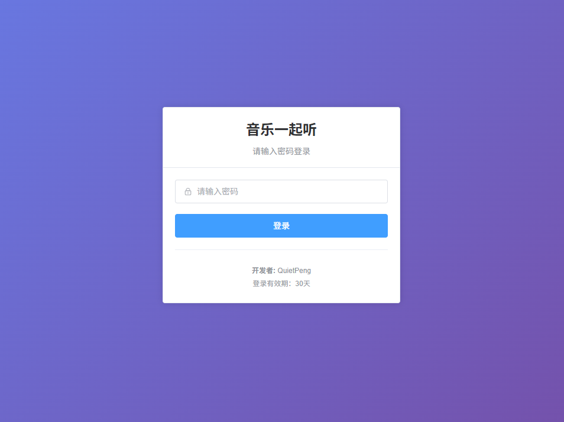
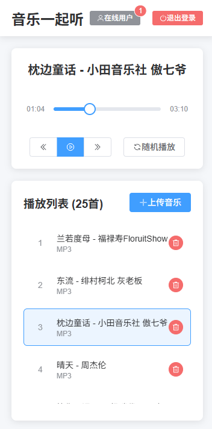

# Music Together

作者：QuietPeng

基于 Flask + UniApp + Vue3 开发的多人实时音乐播放应用。支持跨平台部署，实现多用户同步播放音乐。

构思来源于我喜欢本地下载储存音乐，然后想QQ和女朋友使用一起听功能的时候发现许多歌曲无版权。于是写了这个程序。

## ✨ 主要特性

- 🎵 **多人同步播放** - 实时同步音乐播放进度和状态
- 📱 **跨平台支持** - 支持 H5、小程序、App 等多个平台
- � **用户认证** - 密码登录，JWT Token验证
- 💬 **实时通信** - WebSocket 双向通信
- 🎨 **现代化UI** - 基于 Vue3 Composition API 设计
- 🔋 **后台播放** - 支持后台播放模式





## 🚀 技术栈

### 后端
- **框架**: Flask + Flask-SocketIO
- **认证**: JWT Token + SHA256密码哈希
- **实时通信**: WebSocket / Socket.IO
- **数据存储**: JSON文件存储
- **跨域**: Flask-CORS

### 前端
- **框架**: UniApp + Vue3
- **UI设计**: 原生样式 + CSS3
- **状态管理**: Vue3 Composition API
- **实时通信**: Socket.IO Client
- **构建工具**: Vite
- **开发语言**: JavaScript

## 📱 支持平台

- ✅ H5 (浏览器)
- ✅ 微信小程序
- ✅ 支付宝小程序
- ✅ 百度小程序
- ✅ 头条小程序
- ✅ QQ小程序
- ✅ Android App
- ✅ iOS App

## 🛠 开发环境

- Node.js >= 16.0.0
- HBuilderX (推荐) 或 VS Code
- uni-app CLI

## 📦 安装依赖

```bash
npm install
```

## 🏃‍♂️ 运行项目

### H5端开发
```bash
npm run dev:h5
```

### 微信小程序开发
```bash
npm run dev:mp-weixin
```

### App端开发
```bash
npm run dev:app-plus
```

## 🏗 项目构建

### H5端构建
```bash
npm run build:h5
```

### 微信小程序构建
```bash
npm run build:mp-weixin
```

### App端构建
```bash
npm run build:app-plus
```

## 📁 项目架构

```
Music_together/
├── backend/                    # 后端服务
│   ├── app.py                 # Flask应用主文件
│   ├── requirements.txt       # Python依赖
│   ├── auth.json             # 认证配置(自动生成)
│   └── secret_key.txt        # JWT密钥(自动生成)
├── frontend/                  # UniApp前端工程
│   ├── pages/                # 页面文件
│   │   ├── index/           # 首页
│   │   ├── login/           # 登录页
│   │   ├── musicPlayer/     # 音乐播放器
│   │   └── server-config/   # 服务器配置
│   ├── utils/               # 工具函数
│   │   ├── backgroundPlay.js # 后台播放管理
│   │   ├── serverConnection.js # 服务器连接
│   │   ├── userAuth.js      # 用户认证
│   │   └── musicPlayer.js   # 音乐播放器
│   ├── static/              # 静态资源
│   ├── App.vue             # 应用入口
│   ├── main.js             # 入口文件
│   ├── manifest.json       # 应用配置
│   ├── pages.json          # 页面配置
│   └── package.json        # 项目配置
├── frontend_dist/             # 前端构建产物
|
├── music/                    # 音乐存储
│   ├── storage/             # 音乐文件目录(.mp3/.wav/.flac/.m4a)
│   └── songs.json          # 播放列表数据(自动生成)
└── README.md               # 项目文档
```

## � 环境要求

### 后端环境
- Python >= 3.8
- pip

### 前端环境  
- Node.js >= 16.0.0
- HBuilderX (推荐) 或 VS Code + uni-app插件

## 🚀 快速开始

### 1. 后端部署

#### 安装Python依赖
```bash
cd backend
pip install -r requirements.txt
```

#### 启动后端服务
```bash
python app.py
```

服务将在 `http://0.0.0.0:8080` 启动，首次启动会自动：
- 生成默认密码：`MusicTogether2024!@#`
- 创建 `auth.json` 认证文件
- 创建 `secret_key.txt` JWT密钥文件
- 创建 `../music/storage/` 音乐目录

### 2. 前端开发（UniApp写的，按照其要求运行即可）

#### 安装依赖
```bash
cd frontend
npm install
```

#### 开发运行
```bash
# H5端开发
npm run dev:h5

# 微信小程序开发  
npm run dev:mp-weixin

# App端开发
npm run dev:app-plus
```

#### 生产构建
```bash
# H5端构建
npm run build:h5

# 微信小程序构建
npm run build:mp-weixin

# App端构建
npm run build:app-plus
```

### 3. 运行构建产物

#### H5静态文件部署
```bash
# 使用Python内置服务器 (开发测试)
cd frontend_dist/dist
python -m http.server 8081

# 使用Nginx (生产环境)
# 将 frontend_dist/dist 目录部署到Nginx根目录
```

#### 微信小程序
1. 打开微信开发者工具
2. 导入项目：选择 `frontend_dist/mp-weixin` 目录
3. 配置AppID并预览/上传

## ⚙️ 配置说明

### 修改服务器地址

#### 方法1: 前端配置页面
1. 启动应用后进入"服务器配置"页面
2. 修改服务器地址和端口
3. 测试连接并保存

#### 方法2: 直接修改配置文件
编辑 `utils/serverConnection.js` 中的默认服务器地址：
```javascript
const DEFAULT_SERVER_CONFIG = {
    host: '你的服务器IP',
    port: 8080,
    // ...
};
```

### 修改登录密码

#### 方法1: 直接修改auth.json
```json
{
    "password_hash": "新密码的SHA256哈希值",
    "created_at": "2025-06-27T10:00:00"
}
```

#### 方法2: 删除auth.json重新生成
删除 `backend/auth.json` 文件，重启后端服务将重新生成默认密码。

#### 方法3: 使用Python生成密码哈希
```python
import hashlib
password = "你的新密码"
hash_value = hashlib.sha256(password.encode()).hexdigest()
print(f"密码哈希: {hash_value}")
```

## 🌐 内网穿透部署

### 使用frp内网穿透

#### 1. 下载frp
```bash
# 下载适合你系统的frp版本
wget https://github.com/fatedier/frp/releases/download/v0.52.3/frp_0.52.3_linux_amd64.tar.gz
tar -xzf frp_0.52.3_linux_amd64.tar.gz
cd frp_0.52.3_linux_amd64
```

#### 2. 配置frpc.ini (客户端)
```ini
[common]
server_addr = 你的服务器IP
server_port = 7000

[music_together_backend]
type = tcp
local_ip = 127.0.0.1
local_port = 8080
remote_port = 8080

[music_together_frontend]
type = tcp  
local_ip = 127.0.0.1
local_port = 8081
remote_port = 8081
```

#### 3. 启动内网穿透
```bash
# 后台启动frpc
nohup ./frpc -c frpc.ini > frpc.log 2>&1 &

# 启动后端服务
cd backend && python app.py

# 启动前端服务 (如果使用H5)
cd frontend_dist/dist && python -m http.server 8081
```

### 使用ngrok内网穿透
```bash
# 安装ngrok
npm install -g ngrok

# 穿透后端端口
ngrok http 8080

# 穿透前端端口  
ngrok http 8081
```

## 🔌 API接口文档

### 认证接口
- `POST /api/login` - 用户登录
- `POST /api/verify-token` - 验证Token
- `GET /api/token-status` - 检查Token状态

### 音乐接口
- `GET /api/songs` - 获取播放列表
- `POST /api/upload` - 上传音乐文件
- `DELETE /api/delete/<index>` - 删除歌曲
- `GET /api/music/storage/<filename>` - 获取音频文件

### 播放控制
- `POST /api/play/<index>` - 播放指定歌曲
- `POST /api/pause` - 暂停播放
- `POST /api/resume` - 继续播放
- `POST /api/prev` - 上一首
- `POST /api/next` - 下一首
- `POST /api/shuffle` - 随机播放

### WebSocket事件
- `connect` - 客户端连接
- `disconnect` - 客户端断开
- `state_update` - 播放状态更新
- `sync_position` - 同步播放位置

## � 主要功能

### 用户系统
- 🔐 密码登录认证 (默认: `MusicTogether2024!@#`)
- 👤 用户指纹识别和在线状态管理
- 🕒 登录历史记录和会话管理
- ⏰ 心跳机制和自动清理过期用户

### 音乐播放
- 📂 播放列表管理 (支持.mp3/.wav/.flac/.m4a)
- ▶️ 播放控制 (播放/暂停/上一首/下一首)
- 🔀 随机播放模式
- 📊 实时播放进度同步
- 📤 音乐文件上传和删除

### 实时同步
- 🔌 WebSocket 双向通信
- 🎵 多用户播放状态实时同步
- 👥 在线用户数实时显示
- 💓 客户端心跳保活机制

### 跨平台支持
- 🌐 H5网页版 (支持所有现代浏览器)
- 📱 微信/支付宝/百度/头条/QQ小程序
- 📲 Android/iOS原生App
- 🔋 后台播放模式 (App端)

## 🚨 注意事项

### 部署相关
1. **防火墙配置**: 确保8080端口已开放
2. **文件权限**: 确保music/storage目录有读写权限
3. **音乐格式**: 仅支持 .mp3/.wav/.flac/.m4a 格式
4. **跨域问题**: 后端已配置CORS，支持所有域名访问

### 小程序部署
1. **域名配置**: 需在小程序后台配置合法域名
2. **HTTPS要求**: 生产环境需要HTTPS证书
3. **WebSocket限制**: 小程序对WebSocket连接有并发限制

### App部署
1. **权限申请**: 需要网络访问和存储权限
2. **证书配置**: iOS需要配置开发者证书
3. **后台播放**: 需要申请音频后台播放权限

## 🔗 常见问题

### Q: 如何批量上传音乐？
A: 直接将音乐文件复制到 `music/storage/` 目录，重启后端服务即可自动同步。

### Q: 忘记密码怎么办？
A: 删除 `backend/auth.json` 文件，重启后端会重新生成默认密码。

### Q: 如何支持更多音频格式？
A: 修改 `backend/app.py` 中的 `allowed_extensions` 配置。

### Q: 小程序无法连接服务器？
A: 检查小程序后台的request合法域名和socket合法域名配置。

## 📄 许可证

MIT License

## 👨‍💻 作者

**QuietPeng**

如有问题或建议，请提交 Issue 或 Pull Request。

## 🔗 相关链接

- [UniApp 官方文档](https://uniapp.dcloud.net.cn/)
- [Vue3 官方文档](https://v3.cn.vuejs.org/)
- [Flask 官方文档](https://flask.palletsprojects.com/)
- [Socket.IO 官方文档](https://socket.io/)
